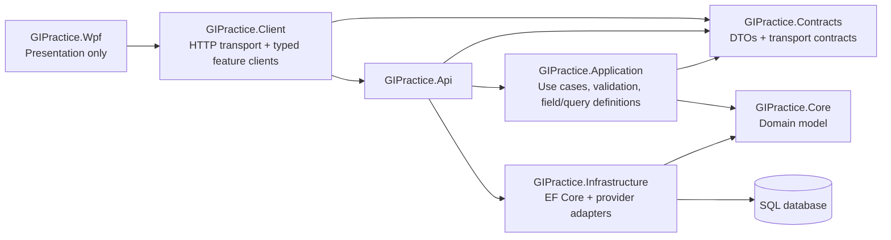

# GIPractice architecture

## Hard boundaries

- WPF does not reference API, Infrastructure or Core.
- Contracts contain serializable transport data only; no EF expressions or domain entities.
- Application owns request validation and canonical field/query semantics.
- Core is the clinical domain and has no presentation concerns.
- Infrastructure owns EF Core and database-provider details.
- The API composes the application and infrastructure and is the only server process.

See `docs/architecture-reset-2026.md` and `docs/field-mapping-strategy.md` for the 2026 reset decisions.
